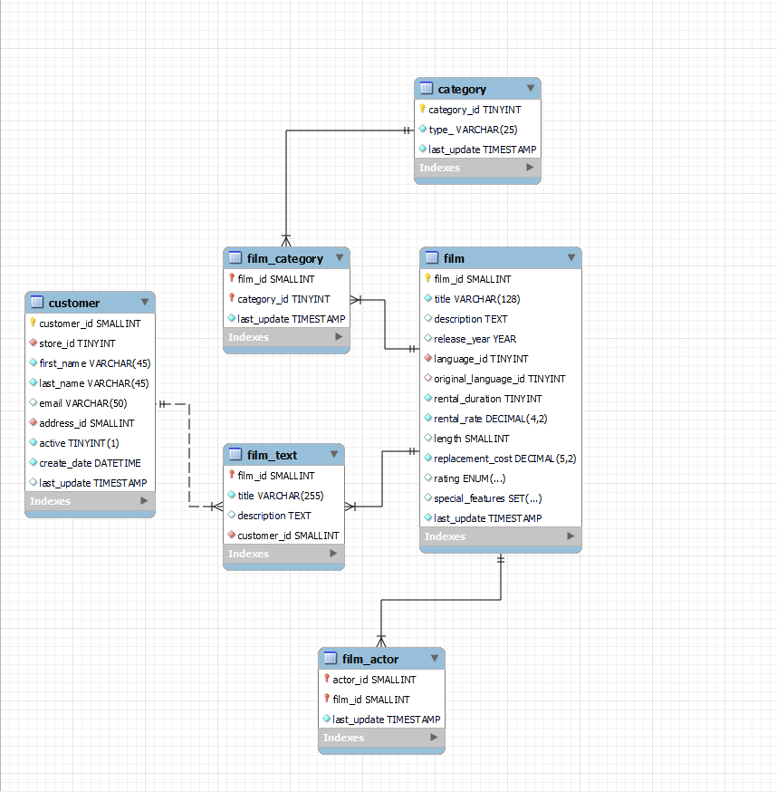
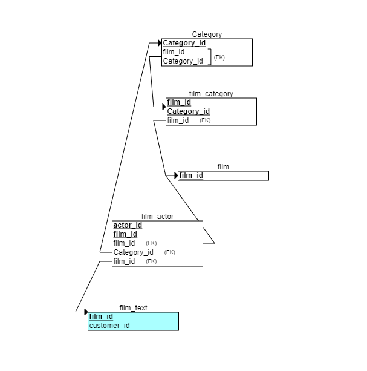

# Video Rental Database Management System

## Introduction

This repository contains the design and implementation of a database schema for Congo, a fictional company operating in the video rental industry. The project aims to create a robust database system capable of efficiently managing various aspects of the video rental business, including customer information, and rental transactions.

In today's digital age, effective management of video rental services remains crucial despite the evolving landscape of media consumption. By developing a comprehensive database schema, we seek to streamline operations, improve data organization, and enhance overall efficiency for Congo and similar businesses.

## Design

The design process involved creating an Entity-Relationship (ER) diagram, a Unified Modeling Language (UML) class diagram, and a database schema based on the requirements provided. The ER diagram depicts the entities and their relationships, while the UML class diagram represents the tables and their associations. The database schema is structured according to the defined tables, their attributes, and foreign key constraints.

## Implementation

The implementation involves using Python Flask as the backend framework and React JS for the frontend. The backend code includes routes for fetching categories, films, and films by category from the MySQL database. Flask-MySQLdb and Flask-CORS libraries are used to interact with the database and handle cross-origin resource sharing (CORS) respectively.

The frontend code utilizes React hooks to manage state and axios for making asynchronous HTTP requests to the backend. The Film component fetches categories on component mount and displays films based on the selected category. Users can view film details, add films to the shopping cart, like films, and share films. Pagination functionality is also implemented to navigate through the list of films.

## Functionality

The project's functionality revolves around managing various aspects of a video rental business, including categories of films, customer information, film details, film categories, film actors, and film text descriptions. The database schema facilitates efficient storage and retrieval of data related to these entities, enabling users to perform tasks such as adding, updating, and querying information.

## User Manual

A user manual, including a video description demonstrating how users can interact with the system, is available in the repository.

## Conclusion

In conclusion, this repository serves as a comprehensive resource for understanding the design and implementation of a database schema for Congo, a fictional video rental company. By following established database design principles and methodologies, we have created a robust system capable of managing various aspects of the business efficiently. This project lays the foundation for further development and enhancement of video rental management systems.
